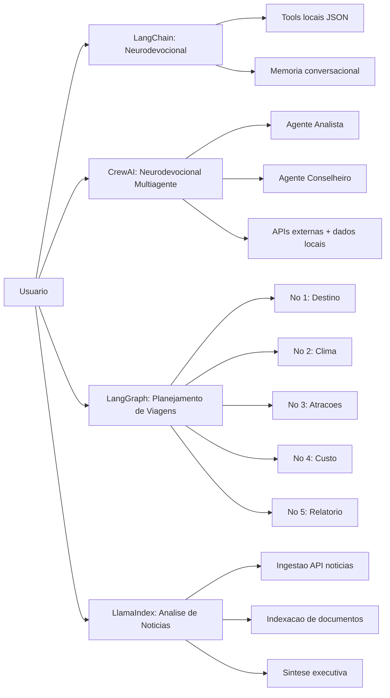

## Checkpoint IA Generativa - Comparativo de Frameworks de Agentes

Este repositório apresenta quatro implementações de agentes de IA, cada uma construída com um framework diferente, para comparar arquitetura, experiência de desenvolvimento e adequação ao problema.

## Problema que os agentes resolvem

Este trabalho ataca um problema comum em produtos com IA:

- Como transformar entrada de usuário e fontes externas em respostas úteis, rastreáveis e fáceis de manter.

Para isso, o projeto foi dividido em quatro cenários práticos:

1. LangChain: orientação neurodevocional com tools e memória.
2. CrewAI: mesma proposta neurodevocional, mas com colaboração entre agentes especializados.
3. LangGraph: planejamento de viagem com pipeline por nós e estado explícito.
4. LlamaIndex: análise e resumo de notícias a partir de múltiplas fontes indexadas.

## Workflow principal (onde cada framework foi usado)



## Estrutura do repositório

- [langchain_version](langchain_version): versão LangChain
- [crewai_version](crewai_version): versão CrewAI
- [langgraph_version](langgraph_version): versão LangGraph
- [llamaindex_version](llamaindex_version): versão LlamaIndex
- [data](data): base local em JSON
- [tests](tests): arquivos de teste

## Como configurar e executar

Cada framework usa ambiente virtual próprio para evitar conflitos de dependências.

### 1) LangChain

```powershell
cd "C:\Users\felip_qx82fss\OneDrive\Área de Trabalho\Checkponit Ia Generativa agents\neurodevocional-ai"
python -m venv venv
.\venv\Scripts\Activate.ps1
pip install -r requirements.txt
cd langchain_version
streamlit run streamlit_app.py --server.port 8501
```

### 2) CrewAI

```powershell
cd "C:\Users\felip_qx82fss\OneDrive\Área de Trabalho\Checkponit Ia Generativa agents\neurodevocional-ai"
python -m venv venv_crewai
.\venv_crewai\Scripts\Activate.ps1
pip install -r crewai_version\requirements.txt
cd crewai_version
streamlit run streamlit_app.py --server.port 8502
```

### 3) LangGraph

```powershell
cd "C:\Users\felip_qx82fss\OneDrive\Área de Trabalho\Checkponit Ia Generativa agents\neurodevocional-ai"
python -m venv venv_langgraph
.\venv_langgraph\Scripts\Activate.ps1
pip install -r langgraph_version\requirements.txt
cd langgraph_version
streamlit run streamlit_app.py --server.port 8503
```

### 4) LlamaIndex

```powershell
cd "C:\Users\felip_qx82fss\OneDrive\Área de Trabalho\Checkponit Ia Generativa agents\neurodevocional-ai"
python -m venv venv_llamaindex
.\venv_llamaindex\Scripts\Activate.ps1
pip install -r llamaindex_version\requirements.txt
python -m streamlit run .\llamaindex_version\streamlit_app.py --server.port 8504
```

## Variáveis de ambiente

Crie um arquivo `.env` na raiz com:

```env
OPENAI_API_KEY=sua_chave
```

## Guia de demonstração para o professor

Sugestão de apresentação curta (3 a 5 minutos):

1. Mostrar o problema e a estratégia de comparar frameworks.
2. Executar LangChain (porta 8501) e explicar tools + memória.
3. Executar CrewAI (porta 8502) e explicar colaboração entre agentes.
4. Executar LangGraph (porta 8503) e destacar fluxo por nós/estado.
5. Executar LlamaIndex (porta 8504) e destacar indexação + síntese de fontes.
6. Fechar com os trade-offs: orquestração, controle de fluxo e uso de contexto documental.

## Diferença humana entre as abordagens

- LangChain: melhor para começar rápido com agente + tools.
- CrewAI: melhor para separar responsabilidades entre papéis de agentes.
- LangGraph: melhor quando o fluxo precisa ser explícito e auditável por etapas.
- LlamaIndex: melhor quando o coração do problema é trabalhar em cima de documentos e contexto recuperado.

## Entrega

Este repositório atende os itens de entrega solicitados:

- Código-fonte completo.
- Documento de design (este README + READMEs de cada framework).
- Instruções de execução.
- Estrutura pronta para demonstração funcional.
